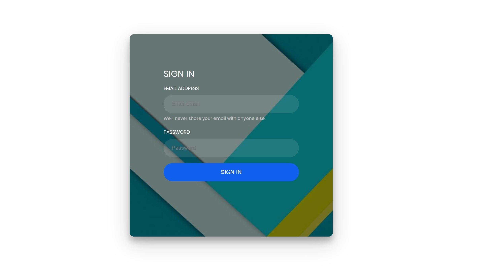
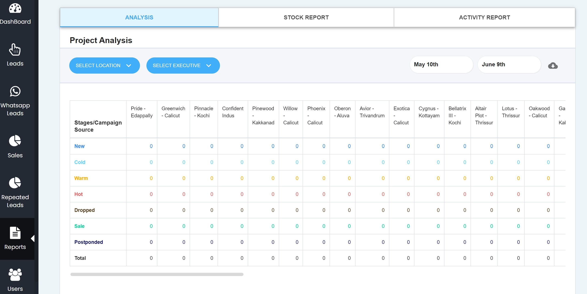
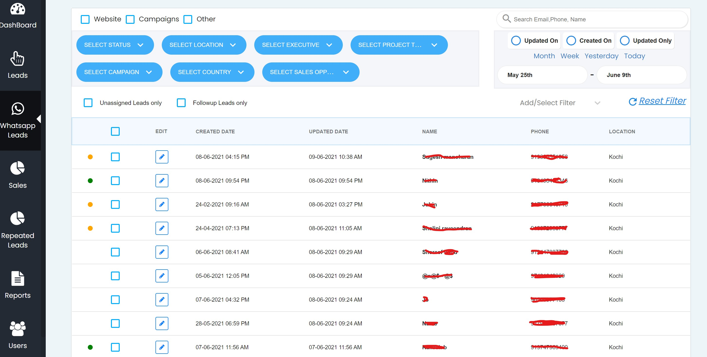

The CRM Web app is built on React, Redux, Bootstrap on the front end and Meteor, mongoDB on backend. MeteorJS is a JavaScript fullstack framework.

<Row>
<Col>

</Col>
<Col>

</Col>
</Row>

<Row>
<Col>

</Col>
</Row>

<Row>

</Row>