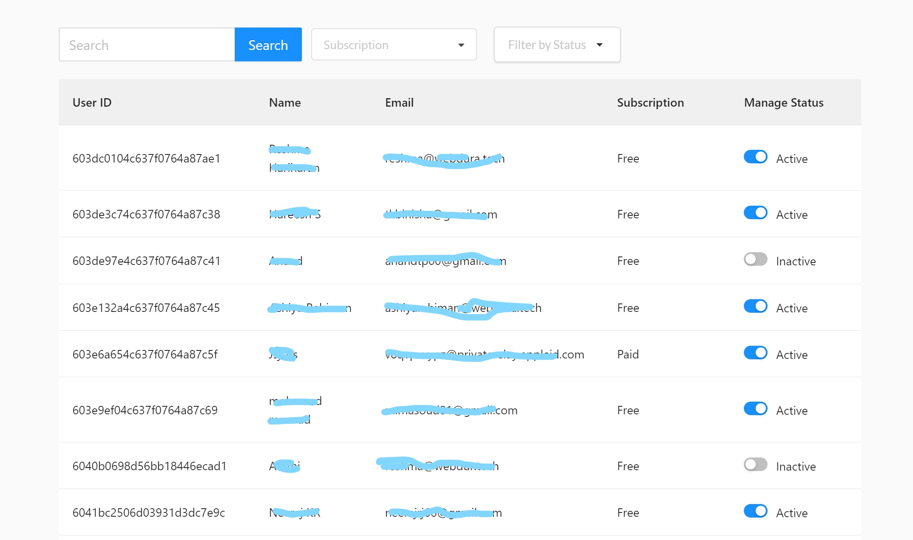
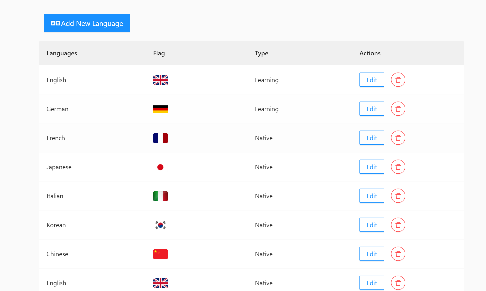
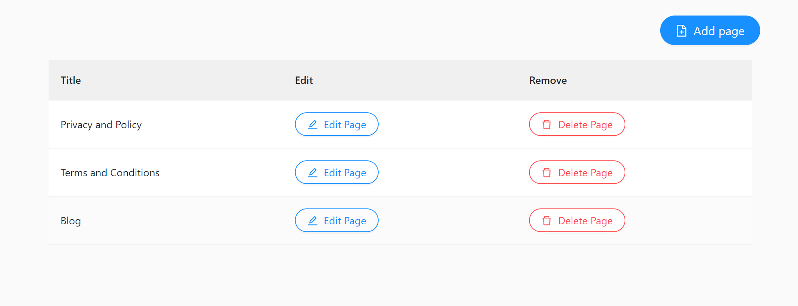

Lyringo admin is a web application that handles all the admin related activities. The Web app is built with React, Redux, Redux-thunk, axios, AntDesign on the front end and featherJS on the backend.

<Row>
<Col>

</Col>
<Col>

</Col>
</Row>

<Row>
<Col>

</Col>
</Row>

<Row>

</Row>