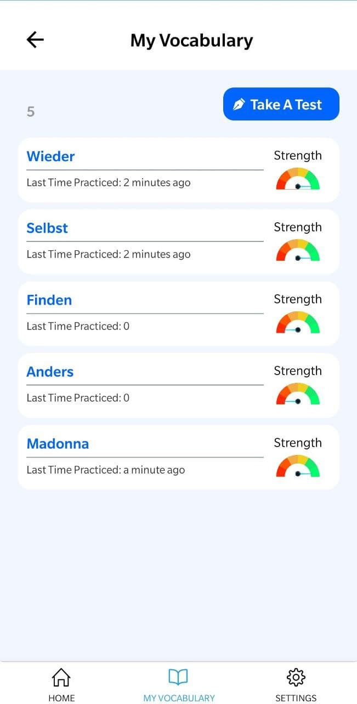
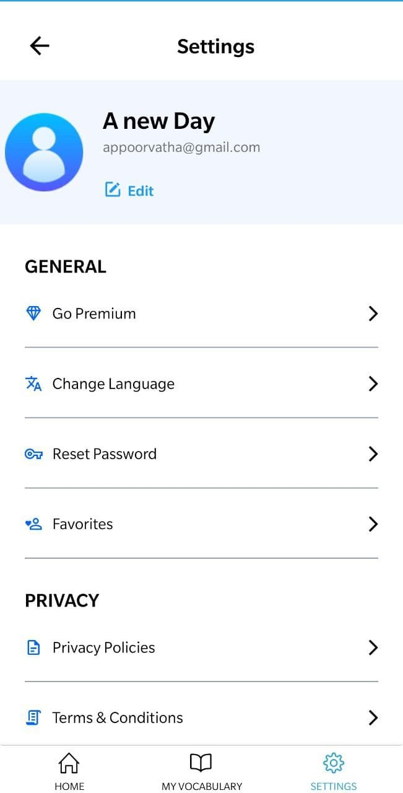

Lyringo is a language learning Mobile App is build with React Native, Redux, Redux-thunk, Axios on the front end. Feather js, MongoDB Firebase on the backend. The App is availible on Playstore and Appstore.

<Row>
<Col>

</Col>
<Col>

</Col>
</Row>

<Row>
<Col>

</Col>
<Col>

</Col>
</Row>
